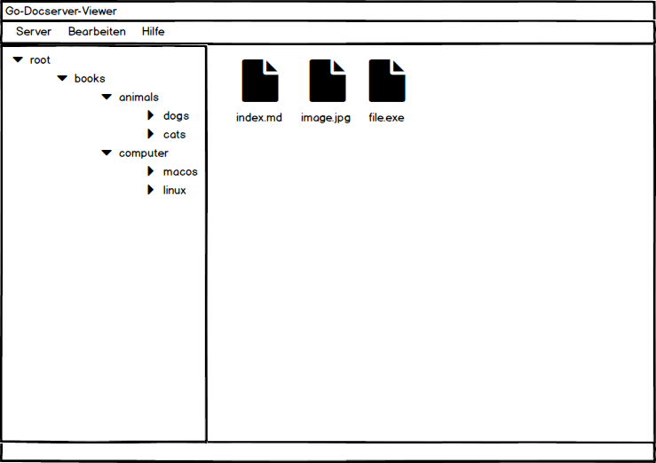
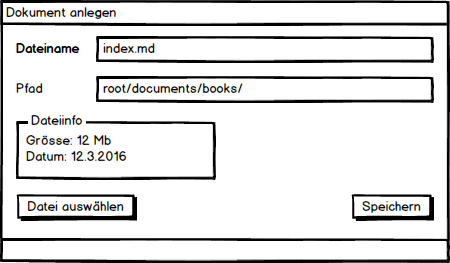
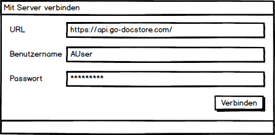

# Go-Docstore-Viewer

## Ausgangslage

Ich entwickle zur Zeit ein Wiki basierend auf Golang. Dabei bin ich auf das Problem gestossen, dass es nur wenige Datenbanken gibt, in denen sich verschachtelte Strukturen nativ ablegen lassen.

Deswegen entwickle ich zur Zeit eine Middleware in Go, welche es erlaubt verschachtelte Dokumentstrukturen nativ abzulegen.

Für diese Middleware fehlt allerdings noch eine Benutzeroberfläche. Dies ist die Aufgabe von Go-Docstore-Viewer.

Mit dem Go-Docstore-Viewer soll es einfach möglich sein, die Dokumenten-Datenbank zu bearbeiten.

## Anforderungen

### Umgebung
* Java 10.0.2 OracleJDK
* Sourcecode-Verwaltung: Git/Github.com
* CI-Server: Travis CI
* UI: JavaFX

### Soll-Anforderungen

* Server-Verbindung anlegen
* Auflisten von Dokumenten
* Anzeigen des Dokumentenbaum
* Erfassung von neuen Dokumenten
* Bearbeiten von Dokumenten
* Löschen von Dokumente

### Kann-Anforderungen

* Verschieben/Kopieren von Dokumenten
* Berechtigungs-System
* Auflisten von Benutzern
* Erstellen von Benutzern
* Löschen von Benutzern
* Bearbeiten von Benutzern

## Rahmenbedingungen

* Die Dokumente müssen verschachtelbar sein.
* Falls zeitlich möglich, wird ein Berechtigungs-System eingebaut.
* Das UI kommuniziert mehrheitlich über eine REST-API mit dem Dokumentenserver.
* Authentifizierung erfolgt über JSON WebTokens.

# Mockups

## Dokumentenübersicht

Listet die Dokumente und Ordner auf. Soll im Stil von Explorer gehalten sein.

## Dokument erstellen

Hier soll ein Dokument erstellt werden können. Zuerst wird der Dateiname und der Pfad eingeben. Anschliessend kann eine Datei vom Dateisystem ausgewählt werden.

## Add Server

Diese View dient dem Hinzufügen eines neuen Servers, so dass eine Verbindung zu ihm hergestellt werden kann.